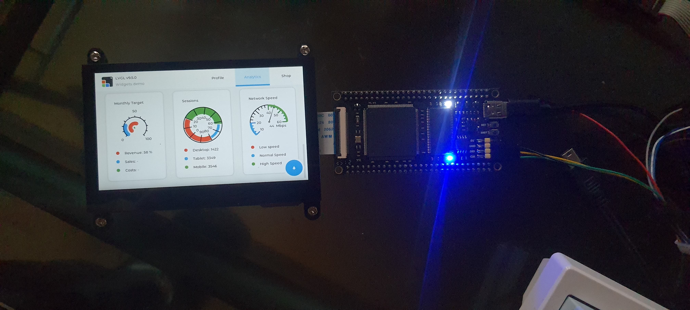
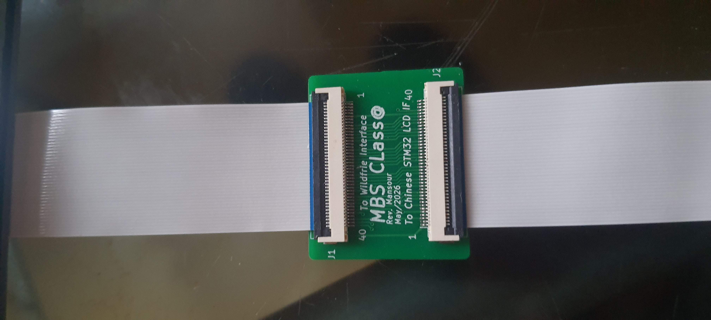

# The Chinese STM32H743 board with LVGL

Yes another chinese stm32 board.



## Features
Like H7B board, i2c pin allocation is the only complaint I have. Had to use bit banging.  
It uses LVGL Direct Mode using Double framebuffer on external SDRAM.  
The performance is below expectations, especially considering the gigantic chip size.  
Anyway, it is what it is.

## LCD Screen
I'm using aliexpress LCD that supports widlfire/atomic interface.  
The screen size is 4.3 inch. CTP IC is FT5406. Resolution is 800x480.  
It's much cheaper than the aliexpress AT something panels that supports the chinese STM32 LCD inteface.  
No way I'm paying freaking $40 or $50 just for the compatible lcd intefrace.  
So a LCD adapter board was created with KiCad. It's cheap to order from JLCPCB and  
easy to solder if you have some skills and soldering equipments.  



There is another adapter board that supports LCD blacklight power directly but work is in progress and parts are still on the way from aliexpress.  

If you are interested, just check [here](https://github.com/peakhunt/FK7B0M1-VBT6-FREERTOS)  

## How to Build and Flash

### 1. Clone the Repository
Pull the project and automatically download the pinned LVGL v9.5.0 submodule package:
```bash
git clone --recursive https://github.com/peakhunt/FK743M2-IIT6-V1.1-FREERTOS
cd FK743M2-IIT6-V1.1-FREERTOS
```

### 2. Compile
```bash
make clean
make -j$(nproc)
```

### 3. Flash the Board
```bash
make stflash
```
